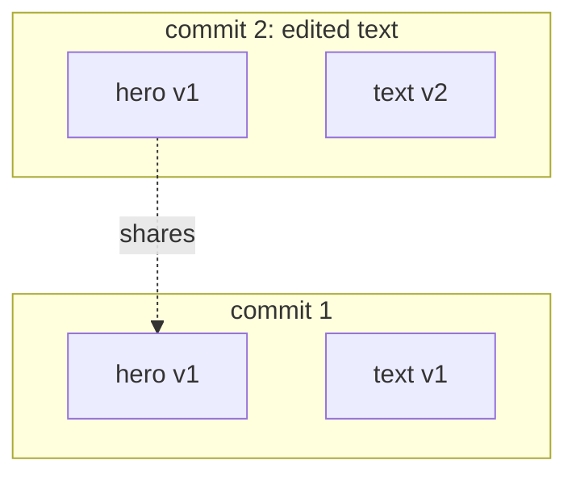

A commit is an immutable snapshot of an entry's block tree at a point in time. Every edit (adding a block, changing a property, deleting a block) creates a new commit. Commits form a chain through `parentCommitId`, and that chain is the entry's history.

## What a commit stores

A row in `commits` holds the `rootId`, a `parentCommitId` (the previous commit), an optional `mergeSourceCommitId` (set only on merge commits), a `message`, the author (`createdBy`), and the branch it was created on (`branchId` plus an `originBranchName` snapshot — see [Branch attribution](#branch-attribution)). It does not store the tree inline. The tree lives in two tables:

- `block_versions`: one row per block per commit where that block changed. It holds the block's `type`, `properties` (JSON), `children` (an array of child block ids), and a `deleted` flag.
- `commit_snapshots`: a materialized index for the commit, mapping each `blockId` to the `blockVersionId` that is active at that commit.

## Copy-on-write

Writing a commit does not copy the whole tree. It inserts new `block_versions` only for the blocks that actually changed, then copies the parent commit's snapshot rows forward for everything else. Unchanged blocks keep sharing their existing version.

This makes history cheap: a small edit on a large page writes one new block version, not a copy of the whole page.

## Why this model

Storing each commit as copy-on-write block versions plus a materialized snapshot trades a little extra write cost and storage for cheap, direct reads of any commit, without walking a diff chain. Snapshots make the common case (reading the head of a branch) fast; the replay path below exists only as a fallback.

## Reading a commit

Every reachable commit is written with a full `commit_snapshots` materialization, so a normal read loads it directly. A commit loses its snapshot only after retention pruning removes it (along with unreferenced `block_versions`); reading such a pruned commit reconstructs it by replaying versions from the nearest surviving snapshot, which can be lossy. The `getBlockTree` response includes a `reconstructed` boolean: `false` when the snapshot was read directly, `true` when it was rebuilt.

## Deletes are tombstones

Deleting a block does not erase its history. It writes a new `block_versions` row with `deleted: true`. The tombstone is left out when the tree is assembled, but it stays in the snapshot so that a merge can tell a deletion apart from an unchanged block.

## Branch attribution

Each commit records the branch it was **created** on, so a history view (`getRootHistory`) can label every commit deterministically — no inference from the commit graph:

- `branchId` links to the live branch, so a renamed branch shows its current name.
- `originBranchName` is a snapshot of the name at creation time; it is the fallback when the branch was later deleted (there is no foreign key, so a deleted branch simply leaves the snapshot in place).

`getRootHistory` returns `branch = COALESCE(live branch name, originBranchName)`. Because the value is stored at write time, shared ancestors are attributed to the branch that actually created them — they are not "claimed" by whichever branch tip happens to be closest.

<Callout type="info">
  Commits are advanced by a [branch](/docs/concepts/branches), combined by a [merge](/docs/concepts/merges), and exposed by [publishing](/docs/concepts/publishing).
</Callout>
