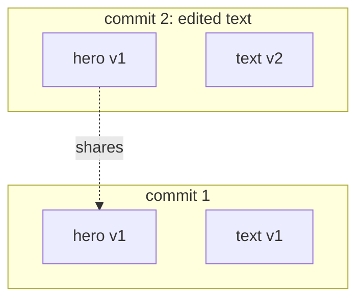
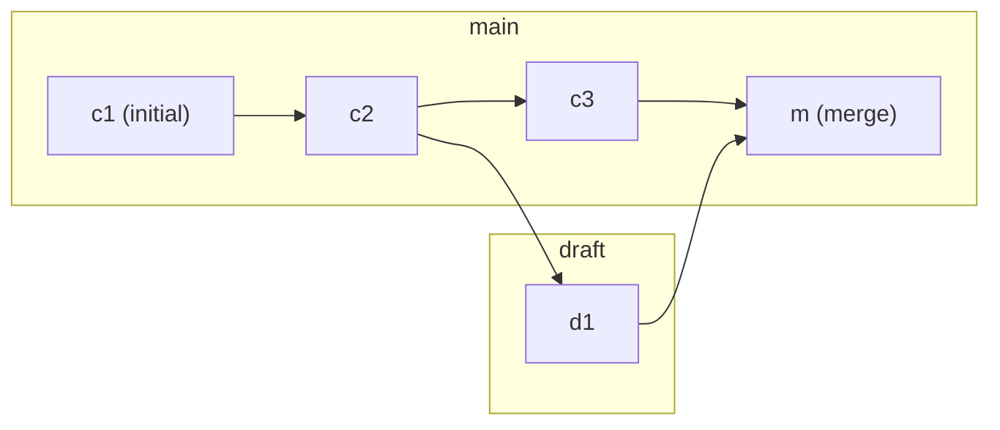

A commit is an immutable snapshot of an entry's block tree at a point in time. Every edit (adding a block, changing a property, deleting a block) creates a new commit rather than mutating the last one. Commits link to their predecessor through `parentCommitId`, and following that chain back from a branch head is the entry's history. The model is deliberately git-like: content moves forward as a sequence of commits, and a [branch](/docs/concepts/branches) is a named pointer into that sequence.

## What a commit stores

A row in `commits` holds the `rootId`, a `parentCommitId` (the previous commit), an optional `mergeSourceCommitId` (set only on merge commits), a `message`, the author (`createdBy`), and the branch it was created on (`branchId` plus an `originBranchName` snapshot; see [Branch attribution](#branch-attribution)). It does not store the tree inline. The tree lives in two tables:

- `block_versions`: one row per block per commit where that block changed. It holds the block's `type`, `properties` (JSON), `children` (an array of child block ids), and a `deleted` flag.
- `commit_snapshots`: a materialized index for the commit, mapping each `blockId` to the `blockVersionId` that is active at that commit.

## Copy-on-write

Writing a commit does not copy the whole tree. It inserts new `block_versions` only for the blocks that actually changed, then copies the parent commit's snapshot rows forward for everything else. Unchanged blocks keep sharing their existing version.



This makes history cheap: a small edit on a large page writes one new block version, not a copy of the whole page.

## Why this model

Storing each commit as copy-on-write block versions plus a materialized snapshot trades a little extra write cost and storage for cheap, direct reads of any commit, without walking a diff chain. Snapshots make the common case (reading the head of a branch) fast; the replay path below exists only as a fallback.

Every commit copies the parent's snapshot rows forward, so a write touches one snapshot row per block regardless of how few blocks changed. That write amplification is bounded by the entry's size (its block count), and its accumulated storage is bounded by [retention](/docs/concepts/data-retention), which deletes old snapshots past `keepDays` while always keeping the `keepMinCommits` most recent. Full snapshots are a deliberate lean toward fast reads: a normal read loads one snapshot directly instead of replaying a chain.

## Commit types

Read back through `parentCommitId` from any branch head and you have that branch's history: the ordered chain of commits that produced its current tree. Branches share their early history, so two branches of the same entry always trace back to a common ancestor commit.

Every commit is one of three types, distinguished by its parent links:

- **initial**: the first commit of an entry. It has no `parentCommitId` and starts the history. `createRoot` writes exactly one, as does duplicating an entry into a new root.
- **commit**: an ordinary edit. Its `parentCommitId` is the branch head at write time, and writing it advances that head. Adding, updating, moving, or deleting a block all produce this type.
- **merge**: the result of combining two branches. It has two parents: `parentCommitId` (the target branch head it landed on) and `mergeSourceCommitId` (the source commit it pulled in). A merge that can [fast-forward](/docs/concepts/branches#divergence) writes no new commit at all; it only moves the target pointer.



The `draft` branch forks at `c2` and is merged back at `m`. That merge commit records `c3` as its `parentCommitId` and `d1` as its `mergeSourceCommitId`, which is why history reads it as a merge with two parents. [`getRootHistory`](/docs/reference/roots#getroothistory) derives the `type` from these links for you.

Nothing is ever edited in place. `createRoot` opens the history with an initial commit; each subsequent call appends onto the branch it targets:

```ts
// createRoot writes the entry's first commit: an `initial` commit, no parent.
const { rootId, branchId } = await cms.api.pages.createRoot({
  body: { slug: 'pricing', properties: { title: 'Pricing' } },
});

// Each later edit appends a `commit` whose parent is the branch's current head.
await cms.api.pages.updateRoot({
  body: {
    rootId,
    branchId,
    properties: { title: 'Plans and pricing' },
    message: 'Rename pricing page',
  },
});
```

## Reading a commit

Every reachable commit is written with a full `commit_snapshots` materialization, so a normal read loads it directly. The [`getBlockTree`](/docs/reference/blocks#getblocktree) response includes a `reconstructed` boolean: `false` when the snapshot was read directly, `true` when a surviving commit's own snapshot was missing (a repaired history) and had to be rebuilt by replaying `block_versions` from the nearest survivor. [Retention pruning](/docs/concepts/data-retention) is not that case: it removes whole commits (their snapshot and the block versions only they held) and reparents the survivors, so a pruned commit is gone rather than reconstructed.

## Deletes are tombstones

Deleting a block does not erase its history. It writes a new `block_versions` row with `deleted: true`. The tombstone is left out when the tree is assembled, but it stays in the snapshot so that a merge can tell a deletion apart from an unchanged block.

## Branch attribution

Each commit records the branch it was **created** on, so a history view (`getRootHistory`) can label every commit deterministically, with no inference from the commit graph:

- `branchId` links to the live branch, so a renamed branch shows its current name.
- `originBranchName` is a snapshot of the name at creation time; it is the fallback when the branch was later deleted (there is no foreign key, so a deleted branch simply leaves the snapshot in place).

`getRootHistory` returns `branch = COALESCE(live branch name, originBranchName)`. Because the value is stored at write time, shared ancestors are attributed to the branch that actually created them, not "claimed" by whichever branch tip happens to be closest.

## Reading history

[`getRootHistory`](/docs/reference/roots#getroothistory) returns an entry's commits across every branch, newest first, each already labelled with its `type` and the [branch](#branch-attribution) it was created on. Every row also carries `parents` (none for the initial commit, one for a normal commit, two for a merge), `isPublished`, `createdAt`, and `createdBy`.

```ts
const { commits } = await cms.api.pages.getRootHistory({
  query: { rootId, limit: 20 },
});

for (const c of commits) {
  console.log(c.type, c.branch, c.message);
  // 'commit'   'main'  'Rename pricing page'
  // 'initial'  'main'  'Initial commit'
}
```

Pass `withChanges: true` to attach a per-commit `changes` count. It is a cheap version-level set-diff against the parent snapshot (no block properties are loaded), so it is coarser than [`getDiff`](/docs/reference/merges#getdiff): a pure move counts as `modified`, an initial commit counts every block as `added`, and a merge is compared against its first parent only. The field is omitted, not zeroed, on any commit whose snapshot was pruned by [retention](/docs/concepts/data-retention).

```ts
const { commits } = await cms.api.pages.getRootHistory({
  query: { rootId, withChanges: true },
});

commits[0].changes; // { added: 0, modified: 1, deleted: 0 }
```

<Callout type="info">
  Commits are advanced by a [branch](/docs/concepts/branches), combined by a [merge](/docs/concepts/merges), and exposed by [publishing](/docs/concepts/publishing).
</Callout>
