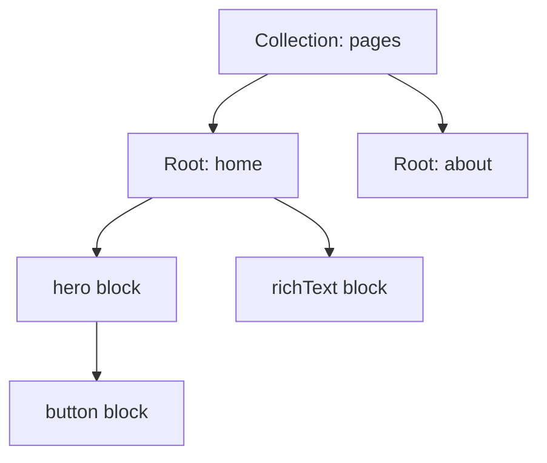
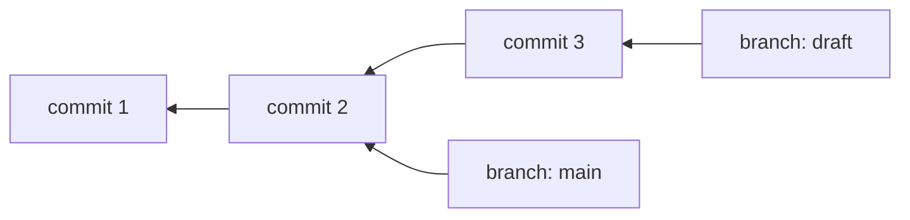
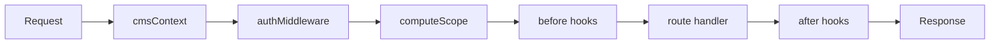

`@createcms/core` is a database-native, block-based CMS with Git-like versioning and an end-to-end type-safe API. You define your content shape once in TypeScript; the CMS derives the database schema, stores content as versioned trees of blocks, and exposes a typed server API and client. This page explains how the pieces fit together and how it works under the hood.

At a glance, the lifecycle is: **define a collection, generate the schema, create a root, add blocks on a branch, publish the branch, read it back, and render**. You can do all of that directly on the `main` branch (see [Build a blog](/docs/guides/build-a-blog)), or use branches and merge requests for review (see [Draft, review, and publish](/docs/guides/content-workflow)). The branch and merge machinery is available, not mandatory.

## Why it's built this way

A few real needs and a few strong influences shaped the design.

**Blocks, from Notion and drag-and-drop editors.** Clients expect to build pages from reusable pieces in a visual editor, and an article on Notion's data model made the case for modeling everything as blocks. So content is a tree of typed blocks rather than fixed fields or one rich-text blob.

**Git, because the requirements already looked like version control.** Drafts, approval before publish, instant rollback, full history, and several versions of a page live at once line up almost exactly with branches, commits, and merge requests. Rather than invent a bespoke draft-and-publish scheme, the CMS borrows Git's proven model. In practice, several people can each draft independently, an SEO manager can stand up the finished page for a client to approve before it goes live, and an AI agent can assemble a new landing page from existing blocks safely on its own branch.

**A data structure that is Git, in PostgreSQL.** The storage model is the result of a lot of iteration. It began as a single "everything is a block" table and ran into slug handling, slow queries, and edge cases. Working from Notion toward Git, it settled on `roots` as the repository (and the home for website concerns like slugs and fast listing), `commits` and `block_versions` for per-block history with copy-on-write (instant rollback, minimal duplication), and `commit_snapshots` as a read cache. The aim throughout was Git's behavior with a relational database underneath.

**Define in code, infer everything.** The schema lives in TypeScript as the single source of truth, both for autocomplete-grade developer experience (inspired by [Better Auth](https://better-auth.com)) and because clearly defined types pay off for AI integrations. There is no separate, UI-configured schema to drift from your code.

**A small core, everything else a plugin.** Many features (multi-tenant, i18n, A/B testing, consent) are useful but few projects need all of them. The core stays small and generic, and those capabilities live in plugins you opt into, an approach modeled closely on Better Auth's plugin architecture.

## The data model

A **collection** is a content type. Each entry of a collection is a **root**, and a root anchors a tree of **blocks**. The root carries the collection's top-level properties; blocks carry their own.

- A [collection](/docs/concepts/collections) defines the shape: root properties, the block types, and optional slug behavior.
- A root is one instance (one page, one post). It has a stable id and lives in the `roots` table.
- [Blocks](/docs/concepts/blocks) are the nodes of the content tree. Each block has a type and typed properties.

## How content is stored and versioned

Content is not stored as a single document. It is stored the way Git stores code: as immutable commits over a tree, with branches pointing at them.

| Table | Holds |
| --- | --- |
| `roots` | The entry: collection, slug, parent, timestamps. |
| `commits` | An immutable snapshot, with a `parentCommitId` and an optional `mergeSourceCommitId`. |
| `block_versions` | A block's state at a commit: `type`, `properties`, `children`, and a `deleted` tombstone. |
| `commit_snapshots` | A materialized index for a commit: `blockId` to `blockVersionId`. |
| `branches` | A named pointer to a `headCommitId`. |
| `publications` | Marks a branch as live (its head is served). |

Writes are **copy-on-write**: a new commit inserts new `block_versions` only for the blocks that changed, and copies the snapshot rows of everything else forward. Unchanged blocks share their version across commits, so history is cheap. A read loads a commit from its `commit_snapshots`; only if those were pruned does it reconstruct from the nearest surviving snapshot (the `reconstructed` flag on `getBlockTree` tells you which happened).

Read [Commits](/docs/concepts/commits), [Branches](/docs/concepts/branches), [Merges](/docs/concepts/merges), and [Publishing](/docs/concepts/publishing) for each piece.

## Under the hood: how a request flows

This section is optional background. `createCMS` returns a `router` (an HTTP handler) and `api` (typed server callers). Both run every call through the same pipeline. The core stays generic; your `authMiddleware` and any plugins inject behavior at fixed points.

1. **Context.** Every endpoint carries metadata (operation, scope, collection). The `cmsContext` middleware seeds the typed context (`db`, `collection`, `scope`, and more).
2. **Auth.** Your `authMiddleware` runs and returns a result (`userId` is optional; anonymous requests omit it). It can return extra fields (a `tenantSlug`, a `language`) that scope the request.
3. **Scope.** `computeScope` merges the scope conditions every plugin registered during `init` into one set of per-table `WHERE` clauses and `INSERT` columns. Core routes apply them automatically, so a tenant or language filter is enforced without the route knowing about it.
4. **Hooks.** Before-hooks can rewrite the input; after-hooks can transform the result.
5. **Handler.** The route reads or writes the database with the scope applied, then returns typed data.

## Two kinds of read

| Read | Endpoint | Returns |
| --- | --- | --- |
| Editing | `getBlockTree` | A branch and commit's tree as stored. References stay as raw `rootId` strings. |
| Published | `getPublishedContent` | The live tree, with embedded references resolved inline and variables substituted. |

This split is why the editor and the public site can read the same content differently from one store.

## How plugins extend the core

A plugin is an object with an `id` and optional extension points. It can add endpoints, contribute database schema, register hooks, and provide scope conditions, a reference resolver, or an A/B-test resolver. Because the core only knows these interfaces, plugins compose without touching it.

<Cards>
  <Card title="Collections" href="/docs/concepts/collections">Roots, slugs, and references.</Card>
  <Card title="Blocks" href="/docs/concepts/blocks">Block properties and field types.</Card>
  <Card title="Media" href="/docs/concepts/media">Assets, folders, and serving.</Card>
  <Card title="Variables" href="/docs/concepts/variables">Reusable values substituted on read.</Card>
  <Card title="Templates" href="/docs/concepts/templates">Per-property default values.</Card>
  <Card title="Redirects" href="/docs/concepts/redirects">Old-to-new URL mapping.</Card>
  <Card title="Commits" href="/docs/concepts/commits">How changes are snapshotted.</Card>
  <Card title="Branches" href="/docs/concepts/branches">Named pointers and divergence.</Card>
  <Card title="Merges" href="/docs/concepts/merges">Merge requests and conflicts.</Card>
  <Card title="Publishing" href="/docs/concepts/publishing">Going live and revalidation.</Card>
  <Card title="Collaboration" href="/docs/concepts/collaboration">Comments, mentions, and approvals.</Card>
  <Card title="Notifications" href="/docs/concepts/notifications">The collaboration inbox.</Card>
  <Card title="Search" href="/docs/concepts/search">Full-text search.</Card>
  <Card title="Data retention" href="/docs/concepts/data-retention">Pruning history and archived content.</Card>
  <Card title="Type safety" href="/docs/concepts/type-safety">How inference flows end to end.</Card>
  <Card title="Plugins" href="/docs/plugins">Extending with plugins.</Card>
</Cards>
