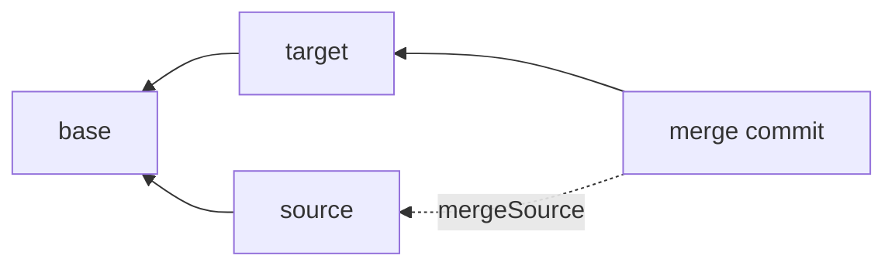

A merge request integrates a source branch into a target branch. It is the review unit: you open it, inspect the diff and any conflicts, get it approved, and then execute the merge. Its status is `open`, `merged`, or `closed`, and there can be only one open merge request per source-target pair.

## The three-way comparison

A merge compares three snapshots: the **base** (the common ancestor of the two branches), the **source**, and the **target**. For each block, the CMS looks at which version is active in each:

- Changed on only one side relative to the base: take that side automatically.
- Unchanged on both, or identical on both: nothing to do.
- Changed differently on both sides: a **conflict**.

`getDiff` classifies the per-block changes of source against base (a two-way diff). `checkConflicts` is the three-way detector: it returns the conflicting blocks, each with its source, target, and base version ids.

## Resolving conflicts

Each conflict is resolved by choosing one of three resolutions, after which the merge can proceed:

| Resolution | Result |
| --- | --- |
| `source` | Keep the source branch's version. |
| `target` | Keep the target branch's version. |
| `manual` | Use any existing block version id, whether preexisting or created with `createMergeBlockVersion`. |

`applyConflictResolutions` records the choices; `executeMerge` refuses to run while any conflict is unresolved (`UNRESOLVED_CONFLICTS`).

## Fast-forward vs merge commit

How the merge is committed depends on whether the target moved:

- **Fast-forward.** If the target's head is still the merge base, the target simply advances to the source head. No new commit is created (the `executeMerge` result's `mergeCommitId` is `null`, though the stored merge request records the source head as its merge commit).
- **Merge commit.** Otherwise the CMS builds a merged snapshot and writes a new commit whose `parentCommitId` is the target head and whose `mergeSourceCommitId` is the source head. That second parent records the merge in history.

### Forcing a merge commit

When the target has **not** diverged, a fast-forward is *possible* but not mandatory. Set `mergeStrategy: 'merge-commit'` in the [config](/docs/reference/configuration#mergestrategy) to always record an explicit merge commit instead — git's `--no-ff` — so every integration is visible in history. The default is `'fast-forward'`.

Override the configured strategy on a single call with `executeMerge({ mergeRequestId, noFastForward })`: `noFastForward: true` forces a merge commit, `noFastForward: false` forces a fast-forward. A diverged target always produces a merge commit regardless of the strategy, and a merge with nothing to integrate (the heads are already equal) is always a no-op fast-forward.

## Approvals

Every merge requires sign-off. You request approval from reviewers with `requestApproval`; each reviewer calls `submitApproval` or `submitRejection`. `executeMerge` throws `MERGE_APPROVAL_REQUIRED` when no approval was ever requested, and `APPROVALS_NOT_FULLY_APPROVED` while any requested approval is still pending. The merge runs only once every requested approval is granted.

<Callout type="info">
  To run the full flow, see [Draft, review, and publish](/docs/guides/content-workflow). For signatures, see the [Server API](/docs/reference/server-api).
</Callout>
