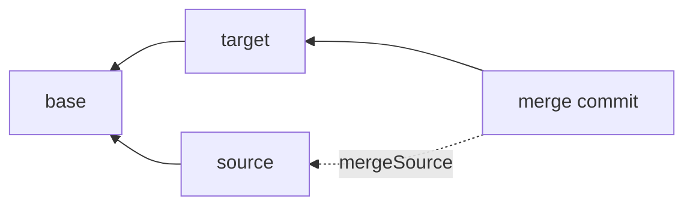

A merge request integrates a source branch into a target branch. It is the review unit: you open it, inspect what changed and any conflicts, get it approved if your workflow calls for that, then execute the merge. Every merge request has a status of `open`, `merged`, or `closed`, and there can be only one open merge request per source-target pair.

The lifecycle is four steps: diff the branches to understand the change, open the merge request to record it, resolve any conflicts, then execute. The sections below follow that spine.

## Why the comparison is three-way

A merge looks at three snapshots of the entry: the **base** (the common ancestor commit the two branches share), the **source**, and the **target**. The base is what makes an automatic merge possible.

To see why, imagine comparing only source and target. You can tell they hold different versions of a block, but not *who* changed it. A two-way comparison cannot separate "I edited this" from "they edited this," so it would have to flag every difference for a human. The base breaks the tie. For each block the CMS looks at the version active in each of the three snapshots:

- Changed on only one side relative to the base: take that side automatically. The other side never touched it, so there is nothing to reconcile.
- Unchanged on both, or changed to the same version on both: nothing to do.
- Changed differently on both sides: a **conflict**. Only a person can say which version wins.

That comparison starts with **version identity**. Every block carries the id of its active version in each snapshot, and the merge compares those ids first — cheap, and decisive for every block that only one side touched. A delete is just another version (a tombstone, see [Commits](/docs/concepts/commits#deletes-are-tombstones)), so editing a block on one side while deleting it on the other is a conflict like any other.

A block **both** sides changed gets a second, property-level pass before it is declared a conflict. In the git analogy the block is a file and its top-level properties are the lines — and like git, the merge reconciles within the block when the two sides touched different parts of it:

- Source and target changed **disjoint sets of top-level properties**: the merge builds a combined version automatically — each changed property from the side that changed it, everything else from the base. The block never surfaces as a conflict.
- Both sides arrived at the **identical result** (same properties, same children): the merge reuses the source's existing version. Agreement — including both sides removing the same property — is not a conflict. Agreement is judged per property, so a shared identical edit merges together with each side's remaining changes.
- Both sides changed the **same property to different values** (richText included), or moved the block's children in different ways, or the two sides disagree on the block's type: a **conflict**, resolved by a person. The merge never combines edits *inside* a single property — two edits to the same rich text field are one conflict, not a word-level merge.

The combined version is written when the merge executes, as part of the merge commit. Until then nothing about an auto-merge is persisted; both `checkConflicts` and `createMergeRequest` report the affected blocks in `autoMergeableBlockIds` so a review UI can show what will combine on its own.

Two methods read this model, one two-way and one three-way:

- [`getDiff`](/docs/reference/merges#getdiff) answers "what changed?". It classifies the source against the base as a flat change list plus an annotated render tree, marking each block `added`, `deleted`, `modified`, `moved`, or `childrenReordered`. Moves are detected by identity, so a block is `moved` only when it truly was, not when a sibling shifted around it. It is the input to visual review; [Review changes visually](/docs/guides/visual-diff) covers rendering it. Its two sides are refs, not only branches: a branch, a commit, or (for the target) the entry's current publication. When one ref is an ancestor of the other, the base **is** that ref and the diff becomes an exact two-way comparison, which is how a publish preview works.
- [`checkConflicts`](/docs/reference/merges#checkconflicts) answers "will it conflict?". It runs the full three-way detection and returns each conflicting block with its source, target, and base version ids, plus the ids of blocks that will auto-merge (`autoMergeableBlockIds`).

## The merge request lifecycle

Opening a merge request runs that same conflict detection once and records the outcome. `createMergeRequest` stores the merge base and the source head as of open time and writes a row for every conflict it finds, so the response tells you immediately whether the branches merge cleanly:

```ts
const { mergeRequest, hasConflicts, conflicts } =
  await cms.api.pages.createMergeRequest({
    body: {
      sourceBranchId: draft.branchId,
      targetBranchId: main.branchId,
      title: 'Homepage refresh',
    },
  });
```

When `hasConflicts` is `false`, the merge can execute as soon as it is approved. When it is `true`, `conflicts` lists the blocks that need a decision, each with its `blockId` and the three version ids, and `executeMerge` refuses to run until every one is resolved.

A merge request is not frozen when you open it. Either branch can keep moving afterward, so `executeMerge` recomputes the base and re-detects conflicts against the **live** branch heads at execute time, then checks them against the resolutions on record. Resolutions you already made still count — they even take precedence over the property-level auto-merge, so if a block you resolved by hand later becomes auto-mergeable because a branch moved, your recorded choice wins — and the merge stays blocked while any current conflict is unresolved.

## Resolving conflicts

Each conflict is settled by choosing one of three resolutions:

| Resolution | Result |
| --- | --- |
| `source` | Keep the source branch's version. |
| `target` | Keep the target branch's version. |
| `manual` | Use any existing block version id, whether preexisting or authored for the merge with [`createMergeBlockVersion`](/docs/reference/merges#createmergeblockversion). |

`applyConflictResolutions` records the choices against the merge request. It does not merge anything yet; `executeMerge` reads the recorded resolutions when it runs and throws `UNRESOLVED_CONFLICTS` while any conflict still lacks one:

```ts
await cms.api.pages.applyConflictResolutions({
  body: {
    mergeRequestId: mergeRequest.id,
    resolutions: [
      // conflictId identifies a stored conflict row on the merge request
      { conflictId, resolution: 'source', resolvedBy: 'editor-1' },
    ],
  },
});

const { commit, fastForward } = await cms.api.pages.executeMerge({
  body: { mergeRequestId: mergeRequest.id },
});
```

`manual` is the **third way**. Rather than pick a side wholesale, author a reconciled version with `createMergeBlockVersion` and point the resolution at it. The new version is persisted immediately and becomes live only when the merge executes, so it is the way to keep, say, one side's headline and the other side's alignment in a single block:

```ts
const { blockVersionId } = await cms.api.pages.createMergeBlockVersion({
  body: {
    mergeRequestId: mergeRequest.id,
    blockId: 'blk_hero',
    type: 'hero',
    properties: { headline: 'The Acme story', align: 'left' },
  },
});

await cms.api.pages.applyConflictResolutions({
  body: {
    mergeRequestId: mergeRequest.id,
    resolutions: [
      {
        conflictId,
        resolution: 'manual',
        resolvedVersionId: blockVersionId,
        resolvedBy: 'editor-1',
      },
    ],
  },
});
```

## Fast-forward vs merge commit

How the merge is committed depends on whether the target moved since the merge base:

- **Fast-forward.** If the target head is still the merge base (the target has not diverged, see [Divergence](/docs/concepts/branches#divergence)), the target simply advances to the source head. No new commit is written. `executeMerge` returns `fastForward: true` and reports the source head as the `commit` that became the new target head, and the stored merge request records that source head as its merge commit.
- **Merge commit.** Otherwise the CMS builds a merged snapshot and writes a new commit whose `parentCommitId` is the target head and whose `mergeSourceCommitId` is the source head. That second parent is what records the merge in history. `executeMerge` returns `fastForward: false` and the new merge commit.

The `fastForward` boolean in the result is the reliable signal of which path ran.

### Forcing a merge commit

When the target has **not** diverged, a fast-forward is *possible* but not mandatory. Set `mergeStrategy: 'merge-commit'` in the [config](/docs/reference/configuration#mergestrategy) to always record an explicit merge commit instead (git's `--no-ff`), so every integration stays visible in history. The default is `'fast-forward'`.

Override the configured strategy on a single call with `executeMerge({ mergeRequestId, noFastForward })`: `noFastForward: true` forces a merge commit, `noFastForward: false` forces a fast-forward. A diverged target always produces a merge commit regardless of the strategy, and a merge with nothing left to integrate (the heads are already equal) is always a no-op fast-forward.



## Approvals

Approvals are **opt-in**, and a merge honors them once they exist. By default a merge needs no sign-off. The moment someone opens an approval request on the merge request, though, `executeMerge` will not bypass it: a request that is still pending or was rejected blocks the merge with `APPROVALS_NOT_FULLY_APPROVED`, and the merge proceeds only once every request is approved.

You request sign-off with [`requestApproval`](/docs/reference/approvals#requestapproval); each reviewer calls [`submitApproval`](/docs/reference/approvals#submitapproval) or [`submitRejection`](/docs/reference/approvals#submitrejection).

To make review mandatory across the board, turn on `requireApprovalToMerge` in [branch protection](/docs/guides/content-workflow#make-review-mandatory). With it on, a merge that has **no** approval request at all throws `MERGE_APPROVAL_REQUIRED`, so an approval becomes a hard precondition rather than something a reviewer has to opt into.

<Callout type="info">
  To run the full flow end to end, see [Draft, review, and publish](/docs/guides/content-workflow). For exact signatures, see the [Merges API](/docs/reference/merges).
</Callout>
