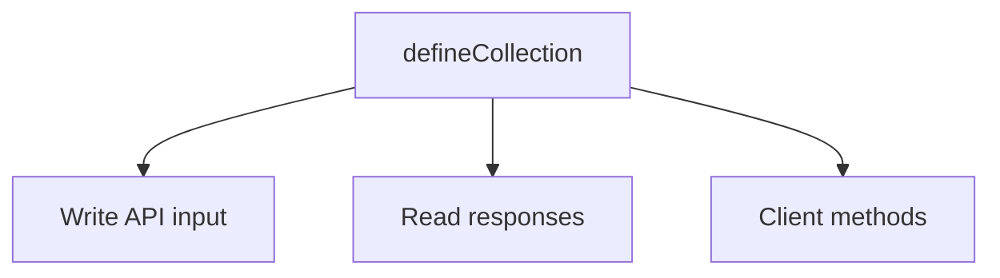

There are no generated TypeScript types to import and no manual interfaces to maintain. Your collection definitions are inferred, and that inference flows through the whole stack.

## One definition, three consumers



A property declared as `{ type: 'string', required: true, label: 'Title' }` becomes a required `string` on create input, a `string` on the read response, and a `string` on the client. Mark it optional, and every consumer updates. Change it to a `select` with options, and the value narrows to the union of those option values.

The database schema is a separate, fixed codegen output, not inferred from collections: properties are stored in a generic JSON column, so adding a collection never changes the schema. See [Commits](/docs/concepts/commits).

## The write side

`createRoot`, `createBlock`, and `updateBlock` accept exactly the properties you defined. A required property is required, and an unknown property is a compile error. Updates use patch semantics: supplied fields overwrite, omitted fields stay, and `null` deletes.

```ts
await cms.api.posts.createRoot({
  body: {
    slug: 'hello',
    properties: { title: 'Hello' }, // `title` is required and typed `string`
  },
});
```

## The read side

`listRoots` and `getBlockTree` return properties typed from the same definition. A block tree is a discriminated union over `type`: narrow on `node.type` and the matching `properties` become available.

```ts
const { roots } = await cms.api.posts.listRoots();
roots[0]?.properties.title; // typed `string`
```

## The client mirrors the server

`createCMSClient<typeof cms>` infers its surface from `typeof cms`, so `client.posts.listRoots()` has the same input and output types as `cms.api.posts.listRoots()`. Passing the wrong query field, or reading a property that does not exist, fails at compile time.

## Why inference, not codegen

Inference means there is no separate generate step to forget and no `.d.ts` to commit and keep in sync: the types cannot drift from the definitions because they are derived from them directly. The cost is more work for the type system (deeply generic types, heavier IDE load on very large schemas), which is the trade this design accepts.

<Callout type="info">
  See [Server API](/docs/reference/server-api) and [Client API](/docs/reference/client-api) for the exact method shapes.
</Callout>
